* # Collecting and Visualizing Live Data from Sensors with Python and MongoDB

## Learning Outcomes

By finishing this session, you should be able to

- Read values from sensors
- Store sensor data in the MongoDB Atlas database
- Visualize sensor data with MongoDB charts

## Github Page

- [https://github.com/scie1006-workshop/2024/workshop2.md](https://github.com/scie1006-workshop/2024/workshop2.md)

## Part 1: Getting Started

1. Power on the ROCK PI device and log in using the provided username and password.

2. Connect to the BU-Standard WIFI network.

   i.  Click the Networks icon in the taskbar, and then click the down arrrow next to BU-Standard and select Configure...

   
   <div style="page-break-after: always;"></div>
   ii.  Configure the connection as follows and then click Apply.

   

   iii.  Click the Connect button on BU-Standard and input your password to connect to the network.

   

   
4. Right-click the desktop and select Create New, followed by Folder.

   
5. Enter "MyProject" as the folder name, then click OK.

   

   <div style="page-break-after: always;"></div>
6. Launch Visual Studio Code by clicking the icon in the taskbar.

   
7. Choose Open Folder from the File menu.

   
8. After finding the MyProject folder on Desktop, click OK. If prompted, select Trust the authors.

   
9. In Explorer, click the New File... button to create a file called **`basics.py`**.

   
10. Copy and paste the code below into **`basics.py`**. You can press `Ctrl+V` to paste the copied code.

    ```python
    import datetime
    print(f'Hello, now is {datetime.datetime.now()}')
    ```
<div style="page-break-after: always;"></div>

10. Choose Save from the File menu or press `Ctrl+S` to save the file.

    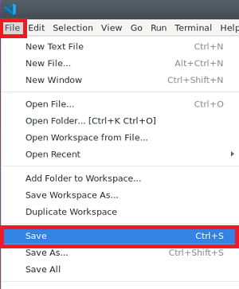
11. Click the run button at the upper right to execute the program. The result will be shown in the terminal.

    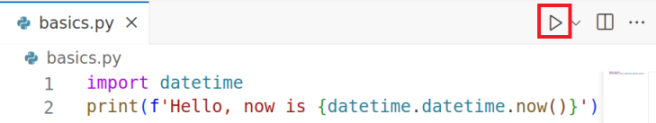

12. Sample output:
    
    


## Part 2: Python Basics

1. Variables and Data Types

   ```python
   number = 123   # int (whole number)
   pi = 3.1415    # float (with decimal points)
   message = "Welcome aboard!"  # string (text)
   ```

   A python variable is created as soon as a value is assigned to it. There are certain rules that we have to keep in mind while creating a variable:
   - The variable name cannot start with a number. It can only start with a character or an underscore.
   - Variables in python are case-sensitive.
   - They can only contain alpha-numeric characters and underscores. No special characters are allowed.
  
2. Basic Arithmetic Operators
   - `+` (addition)
   - `-` (subtraction)
   - `*` (multiplicatoin)
   - `/` (division)
   - `**` (exponentiation)

   ```python
   x = 5
   y = 2
   print(x + y)   # 7
   print(x - y)   # 3
   print(x * y)   # 10
   print(x / y)   # 2.5
   print(x ** y)  # 25
   ```

3. Output Formatting

   ```python
   name = 'Alice'
   print(name) # Alice
   print(f'{name} is pretty.') # Alice is pretty.
   
   temperature = 25.28
   print(temperature)  # 25.28
   print( u'{0}°C'.format(temperature))     # 25.28°C
   print( u'{0:.1f}°C'.format(temperature)) # 25.3°C

   humidity = 55.82
   print(humidity) # 55.82
   print(u'Humidity: {0:.1f}%'.format(humidity)) # 55.8%
   ```

## Part 3: Reading Values from Sensors

   The Rock Pi device's I2C bus number `7` is already wired to an AHT-20 humidity and temperature sensor. The I2C address of the sensor is `0x38`. To read data from the I2C bus, we have to use the    `smbus2` library and follow the instructions in the [hardware data sheet](images/DataSheet-AHT20.pdf).
   
   

   
   1. Create a file called **`sensor.py`** and put the following code into the file.

      ```python
      from smbus2 import SMBus
      import time

      bus = SMBus(7)

      # trigger the sensor to do measurement
      bus.write_i2c_block_data(0x38, 0xAC, [0x33, 0x00])
      # wait for 0.5 seconds 
      time.sleep(0.5)
      # read data from the sensor
      data = bus.read_i2c_block_data(0x38, 0x00, 8)
      ```

      In the above code, we send the `0xAC` command with payload `[0x33, 0x00]` to address `0x38`. The `0xAC` command with payload `[0x33, 0x00]` will trigger the sensor to do the measurement. Then, we wait for 0.5 seconds and read the data from the sensor. The data is read from address `0x38` with command `0x00` and block length equals to `8`. We then store the result data in the data variable.

   2. According to the hardware datasheet, we have to extract the temperature and humidity signals from the data variable using the following code:

      ```python
      temp = ((data[3] & 0x0F) << 16) | (data[4] << 8) | data[5]
      humi = ((data[1] << 16) | (data[2] << 8) | data[3]) >> 4
      ```

      The above code uses `bitwise` operations (`Shift`, `AND` and `OR`) to extract the signals from the data variable. The temperature signal is stored in the `temp` variable, and the humidity signal is stored in the `humi` variable.
      
   3. The formula to calculate the temperature from the `temp` signal is as follows:
      $$Temperature = (\frac{temp}{2^{20}}) \times 200 - 50$$

      We could calculate the temperature value in Celsius degrees and print it out by using the following code:

      ```python
      temperature = temp / (2**20) * 200 - 50
      print(u'Temperature: {0:.1f}°C'.format(temperature))
      ```
      
      *Sample output:*

   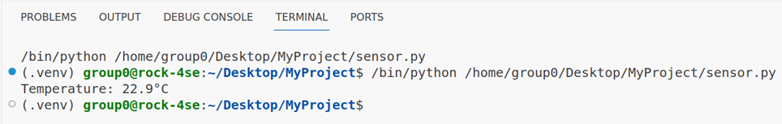
         
            
   5. **Exercise: Calculate and print the humidity**

      The formula to calculate the humidity (in percentage) from the `humi` signal is as follows:
   
      $$Humidity = (\frac{humi}{2^{20}}) \times 100$$

      Add Python code to calculate and print the humidity value (in percentage) in your program using the above formula.

      ```python
      # Exercise code: Read and print the humidity data from the sensor
      # Fill out the ... below
      humidity = ...
      print(...)
      ```

      *Sample output:*
      
   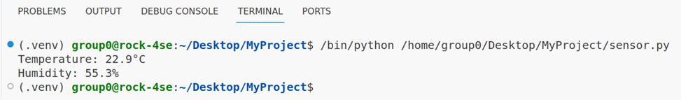

<div style="page-break-after: always;"></div>

## Part 4: Sign up for a MongoDB Atlas account

   We will use a cloud database, MongoDB Atlas, to store the sensor data.

   1. To sign up for a MongoDB Atlas account, go to the following URL:

      [https://www.mongodb.com/cloud/atlas/register](https://www.mongodb.com/cloud/atlas/register)

      
      

   2. You will need to accept the Privacy Policy & Terms of Service. Check the box and click "Submit".

      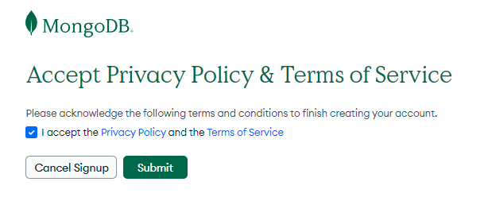
   
   <div style="page-break-after: always;"></div>

   3. You will need to fill out a questionnaire for the first time. You could fill out the questionnaire as follows:

      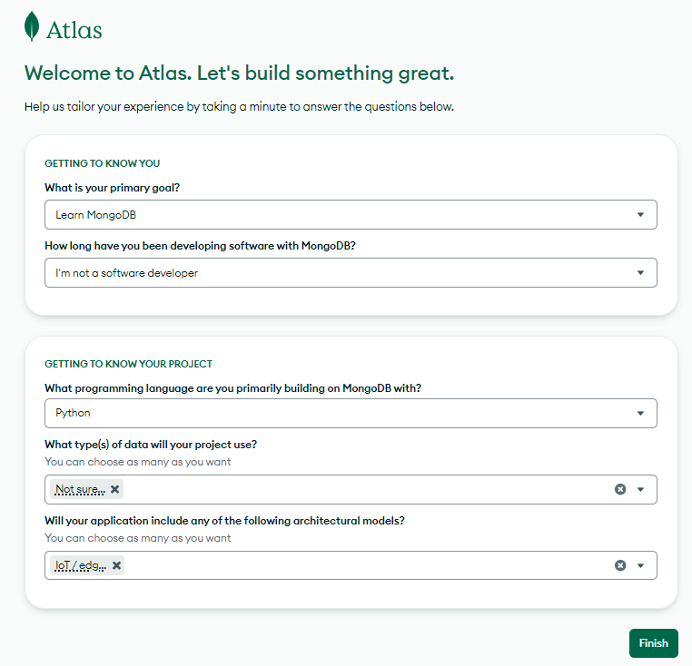

   <div style="page-break-after: always;"></div>

   4. After that, you will need to create a MongoDB cluster. A cluster is a group of servers that store your data. Then, select the "M0" option. Then, select the "AWS" option. In the "Region" dropdown list, select "Hong Kong". Give it a name as you like and click on the "Create Deployment" button.

      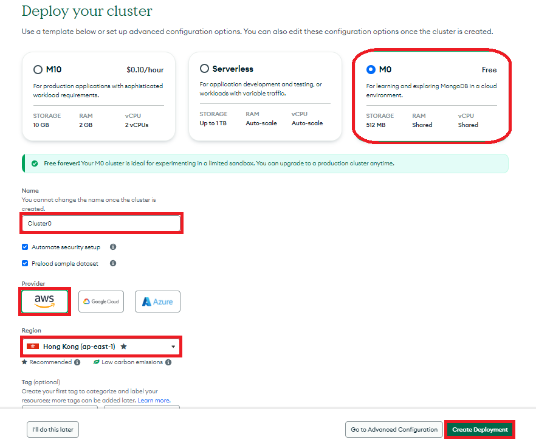

   <div style="page-break-after: always;"></div>

   5. Then, fill in the username and password for your MongoDB database. **Please keep the password as you will need it later**. Then, click on the "Create Database User" button.

      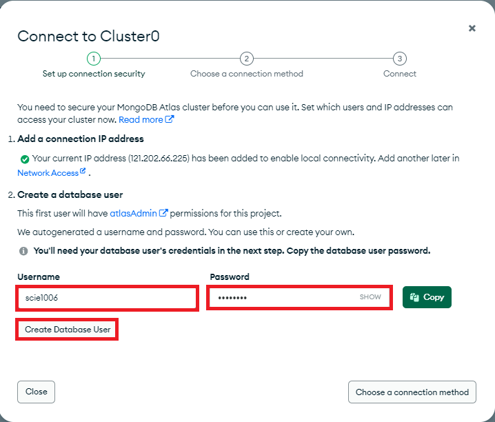

   6. Click "Choose a connection method" to proceed.

      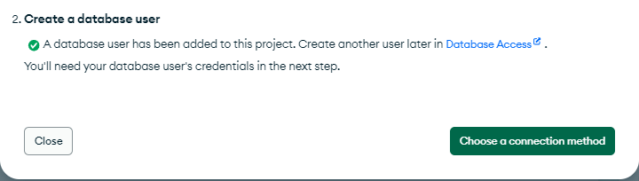

   <div style="page-break-after: always;"></div>

   7. Click on "Drivers". 
   
      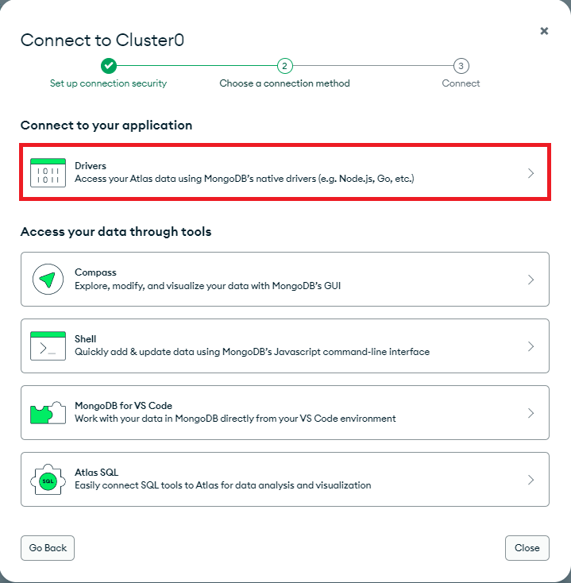

   <div style="page-break-after: always;"></div>

   8. Select "Python" as the driver and "3.6 or later" as the version. Then, click on the copy button to copy the URI to your clipboard.

      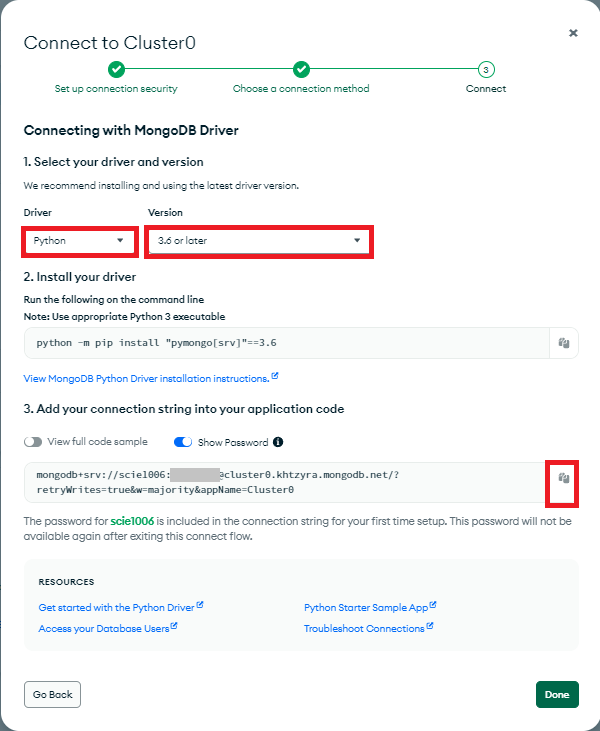

   9. **Paste the URI into the Moodle submission box. Don't forget to replace `<password>` with the password you created for your database user.  You will need to use this URI to connect to the database in your Python code.**
   
      <div style="page-break-after: always;"></div>

   1. Click on "Network Access" in the SECURITY section of the left panel. In the window on the right, change the IP address by clicking "EDIT" after that.

      

   1. Click "ALLOW ACCESS FROM ANYWHERE" and then "Confirm" to finish.

      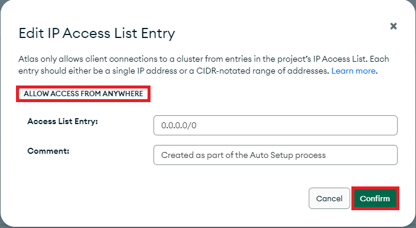

      <div style="page-break-after: always;"></div>
   
## Part 5: Storing sensor data in MongoDB database     

   1. To connect to the MongoDB database, we need to use the `pymongo` library with the following code. Add the following code below the `import time` statement at the top of the program.

      ```python
      from pymongo import MongoClient
      import datetime

      # Your URI copied from the MongoDB Atlas website
      # Replace <password> with the password you created for your database user
      uri = 'mongodb+srv://db:<password>@cluster0...:27017/'
      client = MongoClient(uri)
      db = client.database      
      ```
      
   2. To store data in the MongoDB database, we have to create a record from the sensor data and insert it into the database. Add the following code at the end of the program.

      ```python      
      # Create a record variable to store the sensor data
      record = {
         "sensor_id": 1,
         "temp": temperature,
         "humi": humidity,
         "date": datetime.datetime.now(),
      }

      # Insert the record into the sensors collection
      db.sensors.insert_one(record)
      ```

   3. Now that we have learned how to read sensor data, and store sensor data in a MongoDB database. To continuously read the temperature and humidity data from the sensor and save it in the MongoDB database, we could put everything into an infinite loop as follows.

      ```python
      from smbus2 import SMBus
      import time
      from pymongo import MongoClient
      import datetime
      
      # Your URI copied from the MongoDB Atlas website
      # Replace <password> with the password you created for your database user
      uri = 'mongodb+srv://db:<password>@cluster0...:27017/'
      client = MongoClient(uri)
      db = client.database

      bus = SMBus(7)
    
      # The code block inside the while True loop repeats continuously until 
      # you press Ctrl+C in the terminal
      while True:
         # trigger the sensor to do measurement
         bus.write_i2c_block_data(0x38, 0xAC, [0x33, 0x00]) 
         # wait for 0.5 seconds
         time.sleep(0.5)
         # read data from the sensor
         data = bus.read_i2c_block_data(0x38, 0x00, 8)

         temp = ((data[3] & 0x0F) << 16) | (data[4] << 8) | data[5]
         humi = ((data[1] << 16) | (data[2] << 8) | data[3]) >> 4
         
         temperature = temp / (2**20) * 200 - 50
         print(u'Temperature: {0:.1f}°C'.format(temperature))

         # Exercise code: Read and print the humidity data from the sensor
         humidity = ...
         print(...)         
         
         record = {
            "sensor_id": 1,
            "temp": temperature,
            "humi": humidity,
            "date": datetime.datetime.now(),
         }
         
         db.sensors.insert_one(record)
         
         # wait for 60 seconds
         time.sleep(60) 
      ```

      The above code will read the temperature and humidity data from the sensor every 60 seconds and store the sensor data in the MongoDB database.

      If you would like to stop the program, you may press `Ctrl + C` in the terminal.

      *Sample output:*

      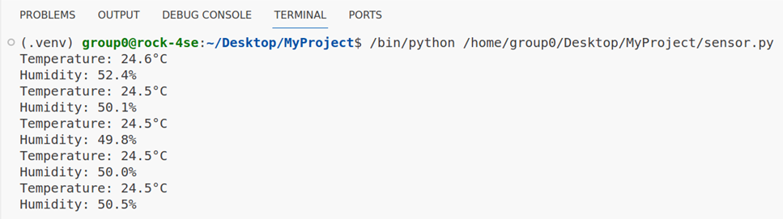


<div style="page-break-after: always;"></div>

## Part 6: Visualizing sensor data with MongoDB

   After we stored the sensor data in the MongoDB database, we could visualize the sensor data with MongoDB Charts. MongoDB Charts is a tool for creating visualizations of data stored in the MongoDB database. It allows us to create charts, graphs, tables, and other visualizations of the sensor data stored in the MongoDB database.

   1. To create a MongoDB Charts project, you may go to the Database Dashboard and click on the "Charts" button.

      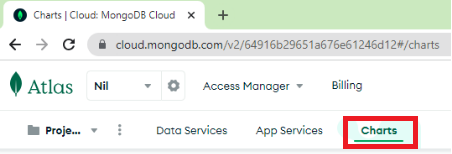

     
   1. Then, click on the "Start" button on the welcome page.

      

      <div style="page-break-after: always;"></div>

   1. After that, click on the "Select" button in "Chart builder".

      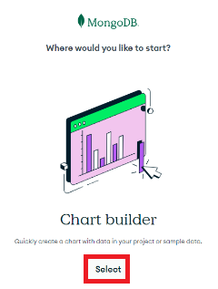
      
   1. You will need to select your database and then the collection as the data source for the chart. Please select the `database` and then `sensors` collection as the data source for the chart.

      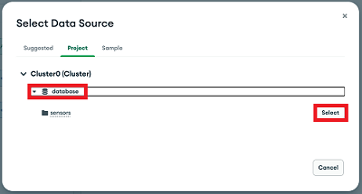
      <div style="page-break-after: always;"></div>
   1. Inside the editor, you will need to select the chart type. Please select the "Continuous Line" chart type.

      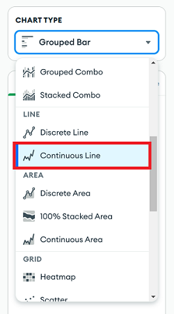
      
   1. To set the axis, you will need to select the "date" field for the X-axis and the "temp" field for the Y-axis. You can drag and drop the fields from the "Fields" panel to the "X-axis" and "Y-axis" panels.

      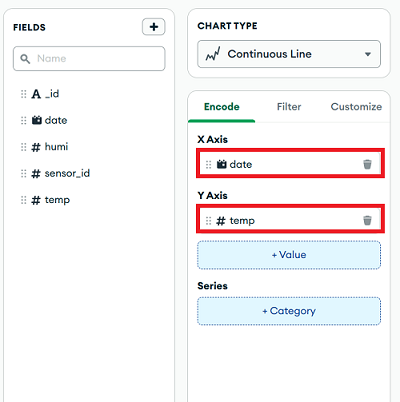
      <div style="page-break-after: always;"></div>
   1. As we want to see the recent temperature change on the chart in real-time, we will need to set the "Filter" for the "date" field to "Previous 1 day" or "Previous 1 hour". 

      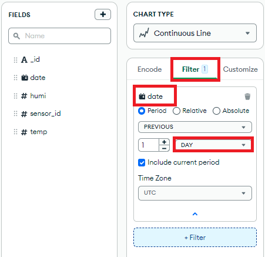

      <div style="page-break-after: always;"></div>

   1. Click on "Enter a title" and type "Temperature" as the title.

      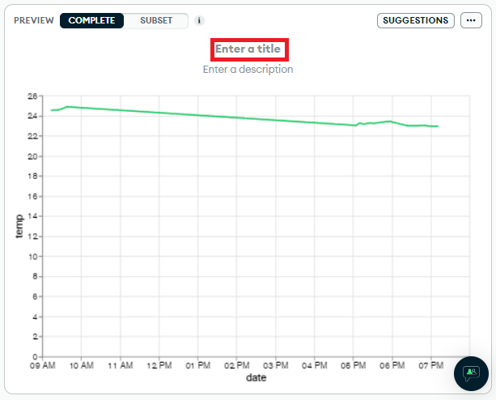
      
   1. Click on the "Save and close" button at the top right corner to save the chart.

      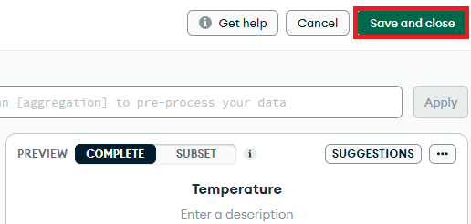
      <div style="page-break-after: always;"></div>
   1. In the dashboard, we can see a refresh button, click on it, and select the refresh settings.
   
      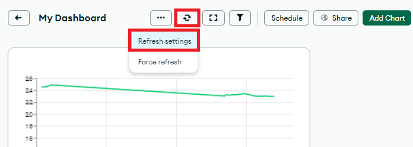
   1. Change the refresh interval to 1 minute. Then, click on the Save button.

      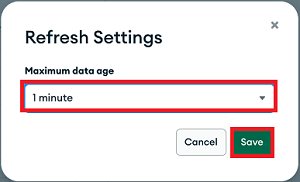
   
      <div style="page-break-after: always;"></div>

   1. **Exercise: Create a chart for the humidity data**

      Click the "Add Chart" button at the top right to create a chart for the humidity using the same steps as above.

      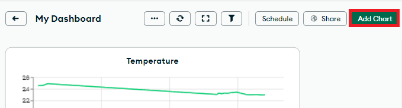

      *Sample output:*

      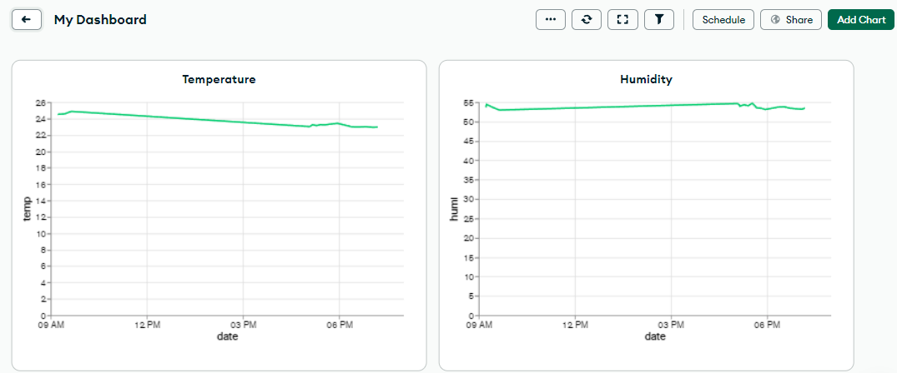

   1. Click the "Share" button to share the dashboard.

      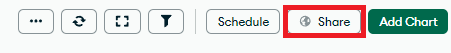
      <div style="page-break-after: always;"></div>

   1. Choose the "Public" tab, and allow everyone with the link to view this dashboard. Then, click the "Manage" button.

      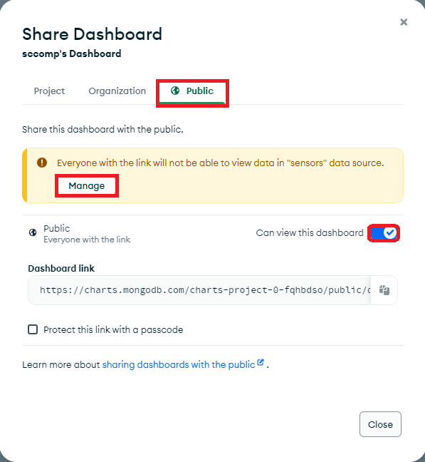
      <div style="page-break-after: always;"></div>
      
   1. Under Data Access, allow unauthenticated data access for the sensors, and then click "Save".

      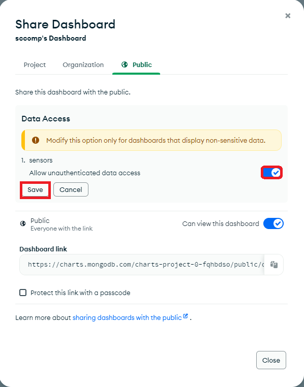
      <div style="page-break-after: always;"></div>

   1. **Copy the Dashboard link and paste it into the Moodle submission box.**

      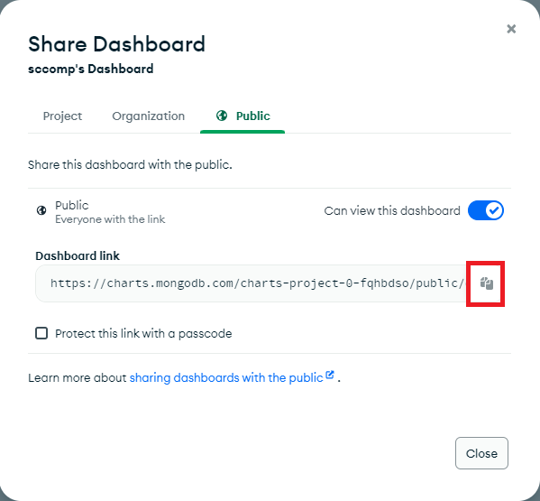

      

## Discussion
Question: Use MongoDB charts to generate effective visualizations for the dataset shown below. You should add the chart(s) to the same Dashboard as in Part 6. Explain why the visuals are effective in no more than 500 words.
- Answer the discussion question in the Moodle submission box.
- Reference: https://www.mongodb.com/docs/charts/
  
#### Dataset: Daily Temperature for 2022
- [daily_temp_2022.json.txt](dataset/daily_temp_2022.json.txt?raw=true)
- [weather_station.json.txt](dataset/weather_station.json.txt?raw=true)
  
The data file `daily_temp_2022.json.txt` contains the daily average, highest and lowest temperatures from nine Hong Kong weather stations for 2022. In the statistics, the time zone “(UTC+08:00) Beijing, Chongqing, Hong Kong, Urumqi” is used. The names, longitudes (coordinates[0]) and latitudes (coordinates[1]) of the nine Hong Kong weather stations are contained in the data file `weather_station.json.txt`.

<div style="page-break-after: always;"></div>

#### How to upload the dataset
1. Under "Data Services", click the "Database" on the left panel, and then click the "Browse Collections" at Cluster0.

   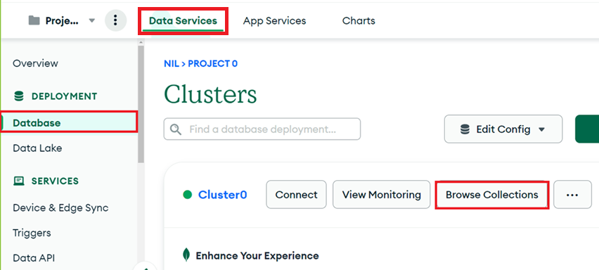
   
2. Click on the (+) button on the right side of the database to create a new collection.

   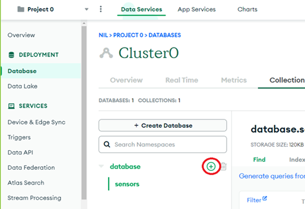

   <div style="page-break-after: always;"></div>

3. Type `daily_temp` as the collection name and then click "Create".

   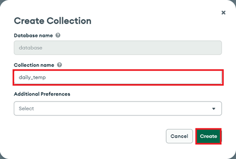
   
4. Click the "INSERT DOCUMENT" button to insert the data records.

   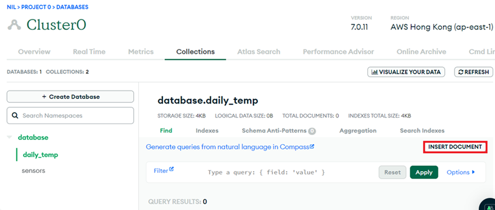
   <div style="page-break-after: always;"></div>
   
5. Clike the `{}` for VIEW, delete all the content in the text area, and then copy and paste the data from `daily_temp_2022.json.txt` into the text area. Click "Insert" to finish.
   
   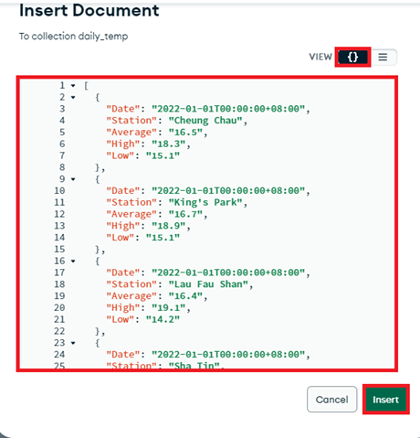
   
6. Repeat steps 2 to 5 to create a new collection called `weather_station` to store the data in the `weather_station.json.txt`
7. You can now build charts in the Dashboard in Part 6. 

<div style="page-break-after: always;"></div>

#### Hint 1: Select the correct data source for your chart
You can see all the collections under the Project tab.

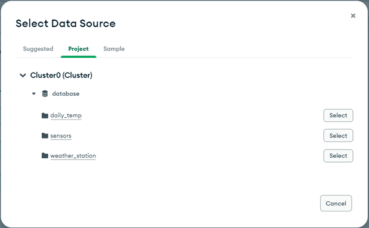

<div style="page-break-after: always;"></div>

#### Hint 2: Convert the field's data type before building the charts
By default, the data fields are stored as strings. You have to convert numbers stored as strings to numbers and convert dates stored as strings to dates.
1. To convert a field's data type, click on that field and select "Convert type" from the Ellipsis (...) menu.

   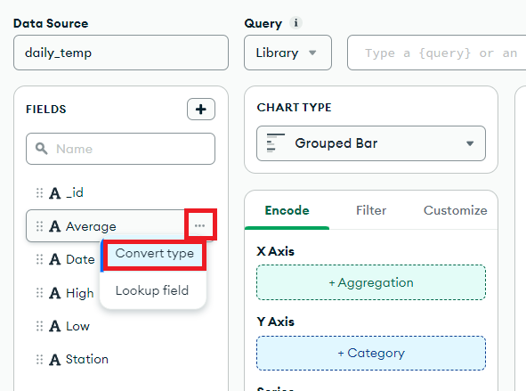
   
2. Data types for daily_temp:
   | Field          | Data type       |
   |:-------------- |:--------------- |
   | Average        | Number          |
   | Date           | Date            |
   | High           | Number          |
   | Low            | Number          |
   | Station        | String          |
      
4. Data types for weather_station:
   | Field          | Data type       |
   |:-------------- |:--------------- |
   | coordinates[0] | Number          |
   | coordinates[1] | Number          |
   | Weather Station| String          |


#### Hint 3: Share the Dashboard again to allow unauthenticated data access for the data collections

   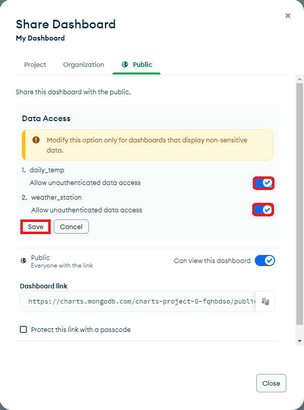

   <div style="page-break-after: always;"></div>
   
## Submission

You have to submit the following items to the Moodle submission box:

-  **`sensor.py`**
- MongoDB connection string (the URI with password)
- MongoDB Atlas Dashboard Link (with charts)
- Discussion Question
  


## References

- Embed charts and dashboards — MongoDB charts. (n.d.). MongoDB: The Developer Data Platform | MongoDB. https://www.mongodb.com/docs/charts/embed-charts-and-dashboards/

- (n.d.). Learn Python Programming - Python Tutorial. https://pythonbasics.org/

- Learn Python programming. (n.d.). Programiz: Learn to Code for Free. https://www.programiz.com/python-programming

- Rock Pi 4 - the next generation RPI. (n.d.). Meet ROCK - Single Board Computers from Radxa. https://rockpi.org/rockpi4

- Tutorial. (n.d.). PyMongo 4.4.1 documentation. https://pymongo.readthedocs.io/en/stable/tutorial.html


<script type="text/javascript" src="http://cdn.mathjax.org/mathjax/latest/MathJax.js?config=TeX-AMS-MML_HTMLorMML"></script>
<script type="text/x-mathjax-config">
   MathJax.Hub.Config({ tex2jax: {inlineMath: [['$', '$']]}, messageStyle: "none" });
</script>

